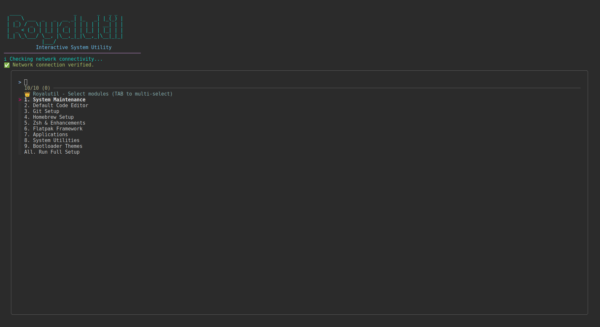

# 👑 Royalutil

<p align="center">
  
  
</p>

An interactive system utility bash script designed to automate the setup and configuration of development environments on Linux with a focus on aesthetics and ease of use.

---

<p align="center">
  
</p>

## ✨ Features

### 🎨 Modern TUI & UX
* **Selective Installation**: Multi-select menu powered by `fzf`. Choose exactly what you want to install.
* **Progress Tracking**: Dynamic progress bar during multi-module execution.
* **Network Awareness**: Automatic connectivity checks before starting downloads.
* **Stylized Interface**: Rounded borders and clear headers for a premium feel.

### 🛠️ Core System (Modular)
* **System Maintenance**: Refresh package lists and upgrade with automatic cleanup.
* **Default Editor**: Safely configure `nano` as the global system editor with markers.
* **Git Setup**: Interactive configuration (identity, global settings, & credential caching).

### 📦 Package & Shell Management
* **Homebrew**: Installs Linuxbrew for extra package support.
* **Flatpak**: Full setup with the Flathub repository enabled.
* **Zsh**: Enhanced with autosuggestions and syntax highlighting.
* **Atuin & Modern Tools**: `fzf`, `fastfetch`, `btop`, `zellij`.

### 🚀 Usage

#### Command Line Arguments
```bash
./royalutil.sh [OPTIONS]

Options:
  -h, --help            Show help message.
  -y, --non-interactive Run all modules without user prompts.
```

#### Interactive Setup
Run without arguments to enter the TUI:
```bash
./royalutil.sh
```
Follow the prompts! Use `TAB` to multi-select modules in the `fzf` menu.

---

## 📜 Requirements

* **OS**: Linux (Debian/Ubuntu-based recommended).
* **Package Manager**: `apt` for base system packages.
* **Connectivity**: Internet connection for downloads.
* **Permissions**: `sudo` access for installations.

---

## 🏁 Post-Installation

1. **New Session**: Restart your terminal to apply shell changes (Zsh, Atuin).
2. **Launch Apps**: Open your application menu or use:
   ```bash
   flatpak run org.mozilla.FirefoxNightly
   flatpak run com.visualstudio.code
   ```
3. **Customize Spotify**:
   - Launch Spotify and log in.
   - Run: `spicetify backup apply` to initialize Marketplace.

---

## 🛠️ Troubleshooting

* **Logs**: Check `~/royalutil_setup.log` for detailed error tracking.
* **Shell**: If commands aren't found, ensure you've restarted your terminal or run `source ~/.zshrc`.
* **Flatpak**: If icons don't appear, a system logout/login may be required.

---

<p align="center">
  Built with ❤️ for the Linux Community
</p>
