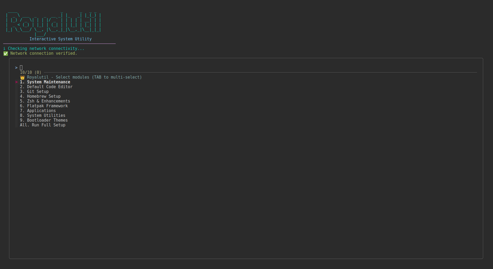

# 👑 Royalutil

<p align="center">
  
  
</p>

An interactive system utility bash script designed to automate the setup and configuration of development environments on Linux with a focus on aesthetics and ease of use.

```bash
curl -fsSL https://raw.githubusercontent.com/royalturd/Royalutil/refs/heads/master/royalutil.sh | bash
```

---

<p align="center">
  
</p>

## ✨ Features

### 🎨 Modern TUI & UX
* **Selective Installation**: Multi-select menu powered by `fzf`. Choose exactly what you want to install.
* **Progress Tracking**: Dynamic progress bar during multi-module execution.
* **Network Awareness**: Automatic connectivity checks before starting downloads.
* **Stylized Interface**: Rounded borders and clear headers for a premium feel.
* **Dry-Run Mode**: Run with `--dry-run` to preview every action a module would take (installs, file edits, shell changes) with zero side effects — no sudo prompt, no package installs, no file writes.

### 🛠️ Core System (Modular)
* **System Maintenance**: Refresh package lists and upgrade with automatic cleanup.
* **Default Editor**: Safely configure `nano` as the global system editor with markers.
* **Git Setup**: Interactive configuration (identity, global settings, & credential caching).

### ↩️ Uninstall / Rollback
* **Config Rollback**: Removes Royalutil's managed lines from `.zshrc`/`.bashrc` (editor & Zsh enhancements).
* **Shell Revert**: Optionally switches your default shell back to `bash`.
* **Cleanup**: Optionally removes the Flatpak apps and CLI utilities Royalutil installed.
* Run via `./royalutil.sh --uninstall` or select it from the interactive menu.

### 📦 Package & Shell Management
* **Homebrew**: Installs Linuxbrew for extra package support.
* **Flatpak**: Full setup with the Flathub repository enabled.
* **Zsh**: Enhanced with autosuggestions and syntax highlighting.
* **Atuin & Modern Tools**: `fzf`, `fastfetch`, `btop`, `zellij`.

### 🗂️ App & Tool Catalog (`royalutil.conf`)
The Flatpak apps (module 7) and CLI utilities (module 8) are no longer hardcoded —
they're read from [`royalutil.conf`](royalutil.conf) at startup. Add or remove a line
there to change what shows up in both the CLI menu and the GUI, no script edits needed:
```
[flatpak]
com.spotify.Client|Spotify|Music streaming

[utilities]
ripgrep|ripgrep|Fast recursive grep
```
* `ROYALUTIL_CONFIG=/path/to/file` points at a different catalog file.
* `ROYALUTIL_APPS=id1,id2` / `ROYALUTIL_UTILITIES=id1,id2` restrict modules 7/8 to just
  those catalog IDs when running non-interactively (`--modules=7`, `-y`, etc.) — this is
  what the GUI's **Install Selected** button uses under the hood.
* If the file is missing, Royalutil falls back to a small built-in default list.

### 🚀 Usage

#### Command Line Arguments
```bash
./royalutil.sh [OPTIONS]

Options:
  -h, --help            Show help message.
  -y, --non-interactive Run all modules without user prompts.
  -u, --uninstall       Roll back Royalutil's config changes.
  -n, --dry-run         Preview what each module would do without changing anything.
  --modules=LIST        Run only the given comma-separated module numbers, non-interactively
                        (e.g. --modules=1,3,8). Intended for scripting/GUI front-ends.
```

#### Interactive Setup
Run without arguments to enter the TUI:
```bash
./royalutil.sh
```
Follow the prompts! Use `TAB` to multi-select modules in the `fzf` menu.

---

## 📜 Requirements

* **OS**: Linux (Debian/Ubuntu-based recommended).
* **Package Manager**: `apt` for base system packages.
* **Connectivity**: Internet connection for downloads.
* **Permissions**: `sudo` access for installations.

---

## 🏁 Post-Installation

1. **New Session**: Restart your terminal to apply shell changes (Zsh, Atuin).
2. **Launch Apps**: Open your application menu or use:
   ```bash
   flatpak run org.mozilla.FirefoxNightly
   flatpak run com.visualstudio.code
   ```
3. **Customize Spotify**:
   - Launch Spotify and log in.
   - Run: `spicetify backup apply` to initialize Marketplace.

---

## 🛠️ Troubleshooting

* **Logs**: Check `~/royalutil_setup.log` for detailed error tracking.
* **Shell**: If commands aren't found, ensure you've restarted your terminal or run `source ~/.zshrc`.
* **Flatpak**: If icons don't appear, a system logout/login may be required.

---

<p align="center">
  Built with ❤️ for the Linux Community
</p>
